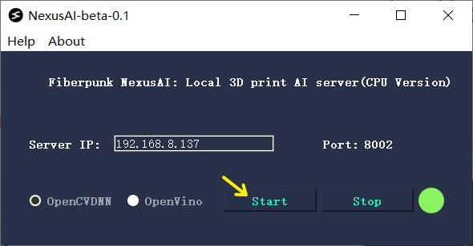
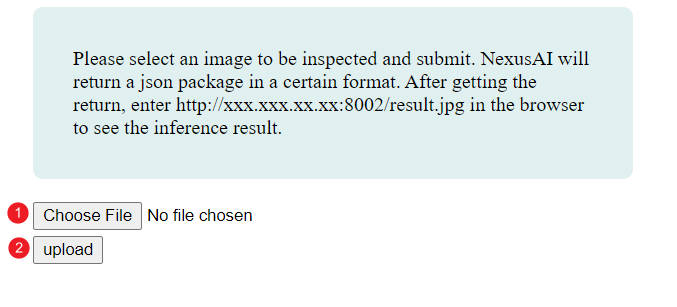
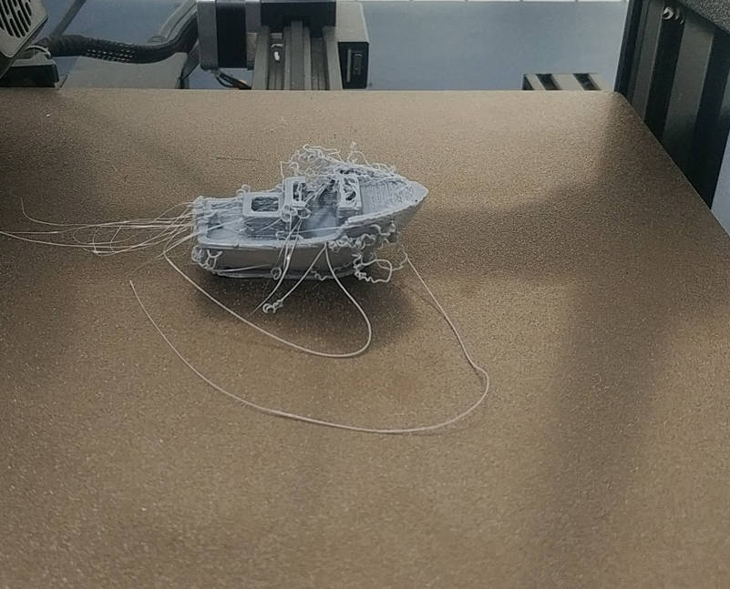
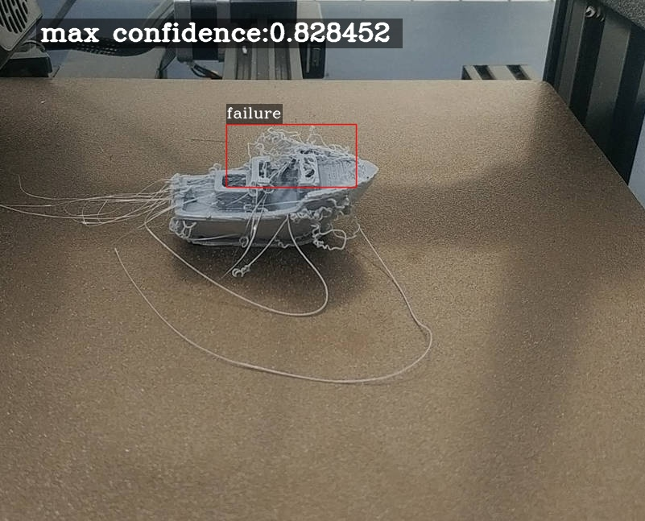

# What is NexusAI

NexusAI is a PC-based local AI inference service program, which currently provides the most basic 3D printing printing failure detection.
After opening NexusAI, you can upload pictures to him through http, and then get the reasoning results of NexusAI.
Nexus AI has the following features:
- Super easy to deploy
- Depends on PC/CPU, you can also use Intel's OpenVino technology to accelerate AI 
- Free personal AI service

# Quick Start

### 1. Download and install
The installation method of NexusAI is very easy. Download the free installation package of NexusAI, open the application, and click start, as shown in the following figure:



### 2. Upload the image using the browser

We provide a simple browser page to submit pictures, enter http://192.168.8.127:8002 in the browser (please enter your own IP), then select the picture and upload it.


Pictures used for testing:


After clicking upload, the json data in the following format is returned:

```json
{
    "result": [
        {
            "box": [
                281,
                154,
                162,
                79
            ],
            "confidence": 0.4528965950012207,
            "label": "failed"
        }
    ],
    "result_count": 1
}
```
- result_count: Indicates the number of failed boxes detected in this picture
- result is a array, contains: box, label, confidence
    - box: The position of the failed box in the picture: [x,y,width,height]
    - confidence: probability of box confidence
    - label: Type description of the result box


Then enter in the browser: http://192.168.8.127:8002/result.jpg to get the picture results of AI inference:



### 3. Call service by using python

It is also very convenient to use python to call the capabilities of NexusAI, and embed the following code into your plugin or project:

```python
import requests

# upload image and return the json result
files = {'media': open('test.jpg','rb')}
r = requests.post('http://192.168.8.127:8002/upload',files=files)

print(r.text)

# get the result.jpg and save to local
image = requests.get('http://192.168.8.127:8002/result.jpg')
with open('result.jpg', 'wb') as img_file:
    img_file.write(image.content)

```
