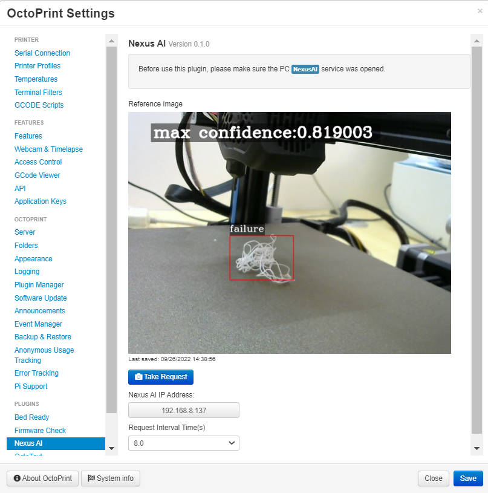
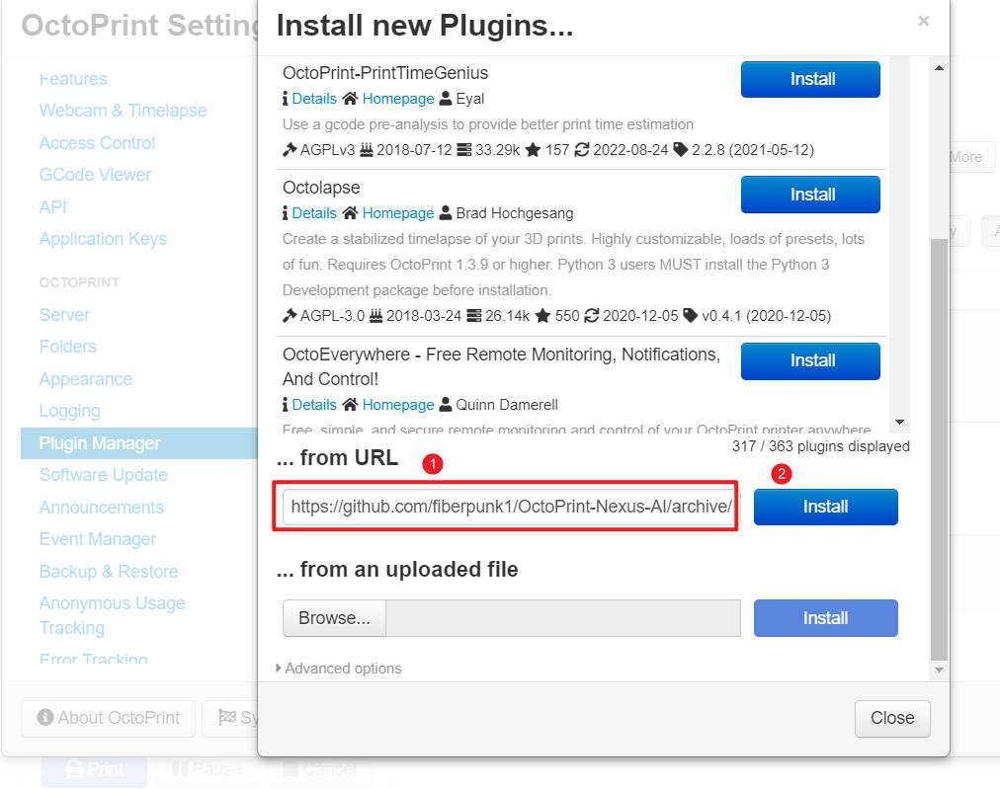
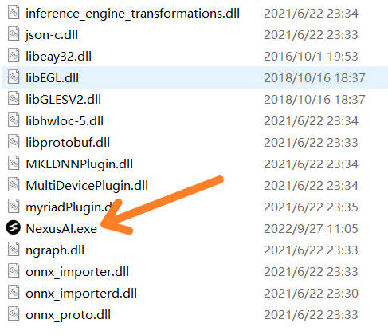
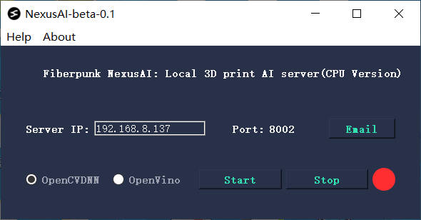
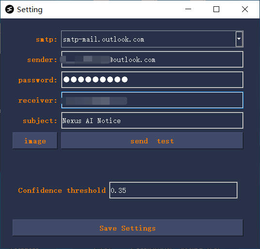

## what is Nexus AI?
Nexus AI is a server program that can detect 3D printing failures by recognizing patterns in pictures uploaded by clients. 
Key features: 
- Free,All features are free recognizing print issues
- Easy to deploy.  Simply install. Just install a program on your old computer.
- Safer than using a cloud service
- Low hardware requirement, it can run on machines without needing the latest high-power CPU, nor it requires GPU to function. 
- Optimized. It can utilize Intel’s Openvino for machine vision model acceleration to boost performance. 

**Free to use!**

Currently only available for Windows-based machines.

## Install

Step by step turitol, please refer this doc: [Nexus AI Turitol](https://docs.google.com/presentation/d/17tiNloVBMYsRRr2qnuSZILDhk4pYkyATVpw55qvDMcA/edit?usp=sharing)

The installation of NexusAI consists of two parts:
- Nexus AI plugin for Octoprint
- Nexus AI server application, install on your PC(windows)

### 1. Install Nexus AI plugin on Octoprint

Install via the bundled Plugin Manager or manually using this URL:

> https://github.com/fiberpunk1/OctoPrint-Nexus-AI/archive/master.zip

**This plugin started out as a fork of the jneilliii's [BedReady plugin](https://github.com/jneilliii/OctoPrint-BedReady)**

 

### 2. Install Nexus AI Service program

download form [here](https://drive.google.com/file/d/1PuoOLkhwPbPDAeVXG8BuHC9-paiJIuUN/view?usp=sharing), unzip and click NexusAI.exe, all done

### 3. Set up service

**1. Email setting**

>Currently only supports outlook email.
>It is recommended that you set up an email account that is only used for this app.

**2. Start service**

When the red status label turn to green, means service started.

**3. Set plugin**

## Credits
- Gina Häußge https://github.com/foosel for creating Octoprint and the plugin Pushbullet from which some of this plugin is developed from.
- jneilliii https://github.com/jneilliii for helping us get past some sticky problems in development

## Community support

- Email: support@fiber-punk.com
- [Website](https://fiber-punk.com/)
- [Facebook](https://www.facebook.com/Fiberpunk-103588222263591)
- [Discord](https://discord.gg/VNNFrfhsbN)

